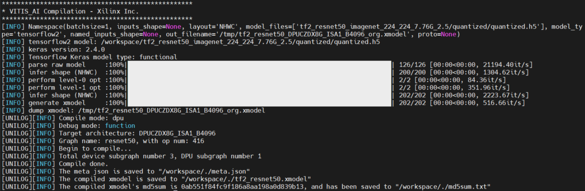

# Build Machine Learning Models for DPU

This folder helps users recompile their own DPU models so they can be deployed
on the board. The recompilation is needed if users want to retarget
a different DPU configuration.

We provide a `compile.py` script that helps users compile their own deployable
models from Vitis AI model zoo. 

## Prerequisites

### 1. Repository

Make sure you have cloned this repository onto your host machine:

```shell
git clone https://github.com/Xilinx/DPU-PYNQ.git
```

### 2. Docker

If you have not installed docker on your host machine, please refer to the
[Vitis AI getting started page](https://github.com/Xilinx/Vitis-AI/tree/v2.5#Getting-Started)
to install docker.

Once you have docker set up, go to the DPU-PYNQ/host folder and run the `prepare_docker.sh` script will download the necessary files from the Vitis AI github repository for running the docker image, including the `docker_run.sh` script. You only need to run the following command once.

```shell
cd DPU-PYNQ/host
./prepare_docker.sh
```

### 3. (optional) `arch.json`

There are 2 cases for different boards:

1. For most boards in this repository the DPU architecture (DPUCZDX8G_ISA1_B4096) is the same as the KV260/ZCU102/ZCU104 arch.json files in the Vitis AI docker. In this case the arch.json files in the docker container can be used to compile models.
2. Some of the smaller boards, like the Ultra96v1/v2 and ZUBoard, the Vitis AI release does not contain
necessary files to recompile the DPU models directly. For the aforementioned boards we provide custom arch.json files comatible with the overlays shipped with DPU-PYNQ. You can use `arch_ultra96.json` and `arch_zuboard.json` files as an `--arch` parameter when compiling for these boards.

If you have rebuilt the DPU hardware design by yourself, you can see
`arch.json` file inside folder 
`DPU-PYNQ/Boards/<Board>/binary_container_1/link/vivado/vpl/prj/prj.gen/sources_1/bd/dpu/ip/design_1_DPUCZDX8G_1_0/arch.json`.
You can also use the `find . -name arch.json` command to locate this file.

For example, the `arch_ultra96.json` file for Ultra96v1/v2 DPU configuration has content:

```shell
{"fingerprint":"0x101000016010404"}
```

**Note**: if you have changed the DPU configurations in your hardware design, 
you must prepare your new `arch.json`.

## Build DPU Models from Vitis AI Model Zoo

The Vitis AI compilers are provided in the Vitis AI docker image. Make sure you ran the `prepare_docker.sh` script first, then run the following to enter the docker environment:

```shell
./docker_run.sh xilinx/vitis-ai:2.5.0
```

The `docker_run.sh` will download a Vitis AI docker image after users accept
the license agreements. It may take a long time to download since the image 
is about 18GB. After the download is complete, the `docker_run.sh` script 
will help you log onto that docker image.

The Vitis AI docker image gives users access to the Vitis AI utilities 
and compilation tools. If you have run `docker_run.sh` before, it will simply 
launch the docker image without downloading again.

### Using the compile.py script

The helper compile.py script takes 3 parameters, you can get more information about the script by invoking `--help`:

```bash
 ./compile.py --help
usage: compile.py [-h] [-n NAME] [-a ARCH] [-o OUTPUT_DIR]

DPU-PYNQ helper script for downloading and compiling models from the Vitis AI modelzoo. For list of models see: https://github.com/Xilinx/Vitis-AI/tree/v2.5/model_zoo/model-list

optional arguments:
  -h, --help            show this help message and exit
  -n NAME, --name NAME  Name of the model as seen in the model zoo list.
  -a ARCH, --arch ARCH  Path to the arch.json file for the DPU architecture you want to compile for.
  -o OUTPUT_DIR, --output_dir OUTPUT_DIR
                        Path to output folder
```

The main requirement is the model name, which we can get by navigating to the Vitis AI github repository and going to the model_zoo/model-list directory:


For example, if you would like to compile a resnet50 model as shown in the screenshot above you would copy that entire name string and pass it as an argument to the `compile.py` script, as such:

```bash
./compile.py --name tf2_resnet50_imagenet_224_224_7.76G_2.5
```

By default the compile function uses `/opt/vitis_ai/compiler/arch/DPUCZDX8G/ZCU104/arch.json` as the target DPU architecture, but you can pass your own architecture as a parameter with `--arch`.

If succesful you should see a compilation output as below:



## Train and Compile Your Own DPU Models from Scratch

Instead of using the deployable models from the Vitis AI model zoo, advanced
users may even train their own machine learning models. We will show
one example in `train_mnist_model.ipynb`, where a small convolutional neural network
is trained on the MNIST hand-written digit dataset. 

From inside the docker environment, activate tensorflow2 conda environment and the launch jupyter notebook.
step-by-step.

```shell
conda activate vitis-ai-tensorflow2
jupyter notebook --ip=0.0.0.0 --port=8080
```

Then simply run the `train_mnist_model.ipynb` notebook and follow the instructions.

For more information such as training your own model, please refer to the 
[Vitis AI user guide](https://docs.xilinx.com/r/en-US/ug1414-vitis-ai)
and [Vitis AI Tutorials](https://github.com/xilinx/vitis-ai-tutorials).

## References

* [Vitis AI Github](https://github.com/Xilinx/Vitis-AI)
* [Vitis AI User Guide](https://docs.xilinx.com/r/en-US/ug1414-vitis-ai)
* [Vitis AI Model Zoo](https://github.com/Xilinx/Vitis-AI/tree/v2.5/model_zoo)

Copyright (C) 2021 Xilinx, Inc

SPDX-License-Identifier: Apache-2.0 License
