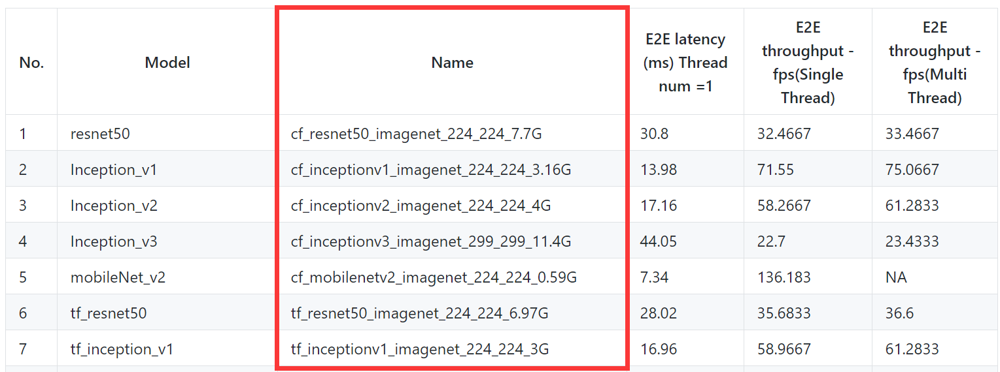

# Build Machine Learning Models for DPU

This folder helps users recompile their own DPU models so they can be deployed
on the board. The recompilation is needed if users want to retarget
a different DPU configuration.

We provide a `compile.sh` script that helps users compile their own deployable
models from Vitis AI model zoo. 

## Prerequisites


### 1. Repository

Make sure you have cloned this repository onto your host machine:

```shell
git clone --recursive --shallow-submodules https://github.com/Xilinx/DPU-PYNQ.git
```

### 2. Docker

If you have not installed docker on your host machine, please refer to the
[Vitis AI getting started page](https://github.com/Xilinx/Vitis-AI/tree/v1.3#Getting-Started)
to install docker. 

### 3. (optional) `dpu.hwh`

There are 3 cases for different boards:

1. For ZCU104, our DPU configuration is consistent with the ZCU104 design of
the Vitis AI release.
2. For ZCU111, our DPU configuration is consistent with the ZCU102 design of
the Vitis AI release.
3. For Ultra96 or other boards, the Vitis AI release does not contain
necessary files to recompile the DPU models directly.

For case 1 and 2, users can leverage existing files on the released docker 
image. No action is required.

For case 3 (Ultra96 or any other board), the DPU configuration file 
(`Ultra96.dcf` or `<Board>.dcf`) does not exist on the released docker image.
We need to prepare the `dpu.hwh` so we can compile it into a DPU configuration
file. 

One way to get the `dpu.hwh` is to 
[download it for Ultra96](https://www.xilinx.com/bin/public/openDownload?filename=pynqdpu.dpu.ultra96.hwh);
remember to rename it to `dpu.hwh` if necessary. 

Alternatively, if you have rebuilt the DPU hardware design by yourself, 
you should see 3 overlay files (`dpu.hwh`, `dpu.bit`, and `dpu.xclbin`) 
inside folder `DPU-PYNQ/Boards/<Board>`. You can take the `dpu.hwh` 
there as well.

**Note**: if you have changed the DPU configurations in your hardware design, 
you must prepare your new `dpu.hwh`.


## Build DPU Models from Vitis AI Model Zoo

On your host machine, as mentioned in the previous section, if you are
building models for Ultra96, you need to put the corresponding `dpu.hwh` file
in folder `DPU-PYNQ/host`.

We can run the following commands now.

```shell
cd DPU-PYNQ/host
mkdir -p docker
cp -rf ../vitis-ai-git/docker_run.sh .
cp -rf ../vitis-ai-git/docker/PROMPT.txt docker
chmod u+x docker_run.sh
./docker_run.sh xilinx/vitis-ai-cpu:1.3.411
```

For the GPU accelerated docker image:
```
./docker_run.sh xilinx/vitis-ai:1.3.411
```

> From version 1.3 .xmodel files are generated instead of .elf

The `docker_run.sh` will download a Vitis AI docker image after users accept
the license agreements. It may take a long time to download since the image 
is about 8GB. After the download is complete, the `docker_run.sh` script 
will help you log onto that docker image.

The Vitis AI docker image gives users access to the Vitis AI utilities 
and compilation tools. If you have run `docker_run.sh` before, it will simply 
launch the docker image without downloading again. 

Once you are in the docker environment, you can run the `compile.sh` script.

```shell
./compile.sh <Board> <model_name>
```

Here `Board` can be `Ultra96`, `ZCU104`, and `ZCU111`. 

For `model_name `  and  `model_performance` , 

users can check the [model performance](https://github.com/Xilinx/Vitis-AI/tree/v1.3/models/AI-Model-Zoo#Model-Performance) page as shown below.



The `compile.sh` eases the compilation of existing DPU models. Users can also
adjust the script to compile their own models. The `compile.sh` does the
following things.

### (1) Adding Ultra96 support

We prepare the `Ultra96.dcf` using the `dpu.hwh` file.

### (2) Downloading a model from model zoo

We download a deployable model as a zip file from
[Vitis AI Model Zoo](https://github.com/Xilinx/Vitis-AI/tree/v1.3/models/AI-Model-Zoo#Model-Download).
The contents of the extracted zip file (e.g., `cf_resnet50_imagenet_224_224_7.7G`) 
will contain multiple versions of the model:

* floating point frozen graph (under `float`)
* quantized evaluation model (under `quantized`)
* quantized deployment model (under `quantized`)

In our case we only need the following files inside the `quantized` directory:
(1) `deploy.caffemodel` and (2) `deploy.prototxt`.

### (3) Compiling the model

We will compile the model into a `*.xmodel` file.
If everything is successful, you should see a screen as shown below.


A new model file (e.g. `dpu_resnet50_0.elf`) should appear in your `build/`
directory; this is the model file that can be deployed on the board.

After you are done with the docker environment, type in:

```shell
exit
```

to exit.

## References

* [Vitis AI Github](https://github.com/Xilinx/Vitis-AI)
* [Vitis AI User Guide](https://www.xilinx.com/support/documentation/sw_manuals/vitis_ai/1_1/ug1414-vitis-ai.pdf)
* [Vitis AI Model Zoo](https://github.com/Xilinx/Vitis-AI/tree/v1.3/models/AI-Model-Zoo)

Copyright (C) 2021 Xilinx, Inc

SPDX-License-Identifier: Apache-2.0 License